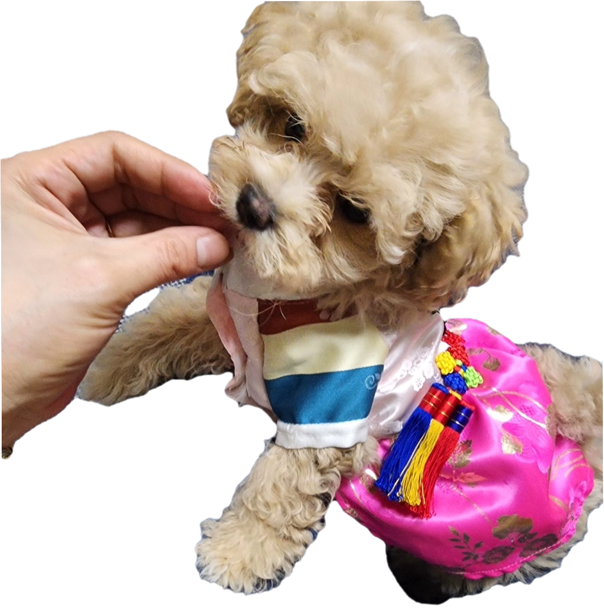
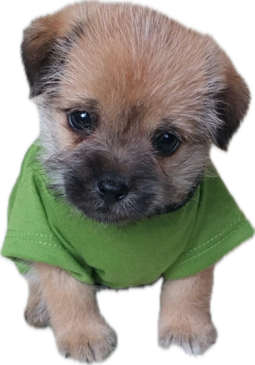

# 🍷 Wine 🍇

<!-- ### 소개
### 배포주소
### 주요기능
### 폴더구조
### 개발스택
### R R
### 프로세스
### 깃 전략 -->

🎈 프로젝트 소개
WINE은 와인을 탐색하고 와인을 사랑하는 사람들이 모여 소통할 수 있도록 만든 웹애플리케이션입니다.
다양한 와인을 쉽게 검색하고, 가격대나 종류별로 필터링하며, 원하는 와인을 빠르게 찾을 수 있어요.
나만의 와인 창고를 관리하며, 좋아하는 와인을 등록하고, 자유롭게 리뷰를 남길 수 있어요.

"이제 와인 고를 때 자신 있어요! 🍷"
"다른 사용자 리뷰를 보고 새로운 와인을 시도해 봤어요! 💬"
"내가 좋아하는 와인을 쉽게 기록하고 공유할 수 있어서 좋아요! 🙌🏻"

## 🚀 배포 서비스

[지금 바로 당신의 와인 취향을 발견하고, 함께 나눠보세요! 🍷](https://wine-nu.vercel.app)

## ✨ 주요 기능

✅ **구글/카카오 로그인** : 구글 및 카카오 계정을 통해 간편하게 로그인할 수 있어요.</br>
✅ **와인 검색** : 키워드로 원하는 와인을 빠르게 찾을 수 있어요.</br>
✅ **필터링 기능** : 종류, 가격, 평점 등 다양한 기준으로 와인을 쉽게 탐색해요.</br>
✅ **와인 등록** : 로그인 후 직접 와인을 등록해 나만의 와인 컬렉션을 만들어 보세요.</br>
✅ **리뷰 작성** : 각 와인에 대한 나만의 리뷰를 작성하고, 다른 사용자와 의견을 나눌 수 있어요.</br>
✅ **와인 관리** : 등록한 와인은 언제든 수정하거나 삭제할 수 있어요.</br>
✅ **리뷰 관리** : 등록한 리뷰는 언제든 수정하거나 삭제할 수 있어요.</br>
✅ **반응형 디자인** : PC, 태블릿, 모바일 어디서든 사용 가능해요.</br>
어디서든 사용 가능해요.

## 📁 디렉토리 구조

```
WHYNE/
├── public/
└── src/
    ├── apis/                    # API 인스턴스 설정
    ├── app/
    │   ├── (non-header)/        # 헤더 없는 페이지
    │   │   ├── login/           # 로그인 페이지
    │   │   ├── signup/          # 회원가입 페이지
    │   │   └── design-system/   # UI 컴포넌트 시스템
    │   ├── (with-header)/       # 헤더 있는 페이지
    │   │   ├── myprofile/       # 마이페이지
    │   │   │   └── (tab)/       # 탭 기반 UI
    │   │   └── wines/           # 와인 관련 페이지
    │   │       └── [wineId]/    # 와인 상세 페이지
    │   └── api/                 # Next.js API 라우트
    │       ├── auth/            # 인증 API
    │       ├── images/          # 이미지 업로드
    │       └── wines/           # 와인 관련 API
    ├── components/              # 재사용 컴포넌트
    ├── stores/                  # 상태 관리 (Zustand)
    ├── libs/                    # 유틸리티 라이브러리
    └── types/                   # TypeScript 타입 정의
```

### 🛠️ 기술 스택

### 🖥️ 프론트엔드

<div className="flex flex-wrap items-center gap-2">
  
  
  
  
  
  
  
  
  
  
</div>

### 스타일링

<div>


</div>

### 🛠️ 개발 환경 및 도구

<div>


### 🚀배포

</div>

<div>

### 🔍 코드 품질 관리

<div>


</div>

### 📄 문서화 및 협업

<div>


</div>

## ⚙️ 커밋 컨벤션

```bash
[#123] feat: 로그인 기능 구현함
[#456] fix(api): 응답 필드 누락 수정함
[#789] fix(api): 응답 필드 누락 수정함
```

wine-nu.vercel.app

## 👥 팀원 소개

<div className="flex my-8 gap-x-1">

{/_ 명지우 _/}

  <div className="flex-1 text-center p-6 rounded-xl shadow-lg text-white bg-gradient-to-br from-[#f093fb] to-[#f5576c]">
    
    <h3 className="mb-4 text-lg font-bold">명지우</h3>
    <ul className="text-left list-none p-0 m-0">
      <li className="relative mb-2 pl-4"><span className="absolute left-0 text-[#ffd700]">•</span>팀장, 프로젝트 총괄</li>
      <li className="relative mb-2 pl-4"><span className="absolute left-0 text-[#ffd700]">•</span>프로젝트 초기 세팅</li>
      <li className="relative mb-2 pl-4"><span className="absolute left-0 text-[#ffd700]">•</span>프로젝트 컨벤션 작성</li>
      <li className="relative mb-2 pl-4"><span className="absolute left-0 text-[#ffd700]">•</span>수행 계획서 작성</li>
      <li className="relative mb-2 pl-4"><span className="absolute left-0 text-[#ffd700]">•</span>메인 랜딩 페이지 구현</li>
      <li className="relative mb-2 pl-4"><span className="absolute left-0 text-[#ffd700]">•</span>공통 컴포넌트 작업</li>
      <li className="relative mb-2 pl-4"><span className="absolute left-0 text-[#ffd700]">•</span>PPT 제작</li>
      <li className="relative mb-2 pl-4"><span className="absolute left-0 text-[#ffd700]">•</span>디자인 시스템</li>
      <li className="relative mb-2 pl-4"><span className="absolute left-0 text-[#ffd700]">•</span>와인 목록 페이지</li>
    </ul>
  </div>

{/_ 유용민 _/}

  <div className="flex-1 text-center p-6 rounded-xl shadow-lg text-white bg-gradient-to-br from-[#667eea] to-[#764ba2]">
    
    <h3 className="mb-4 text-lg font-bold">유용민</h3>
    <ul className="text-left list-none p-0 m-0">
      <li className="relative mb-2 pl-4"><span className="absolute left-0 text-[#ffd700]">•</span>와인 상세 페이지 구현</li>
      <li className="relative mb-2 pl-4"><span className="absolute left-0 text-[#ffd700]">•</span>공통 컴포넌트 작업</li>
      <li className="relative mb-2 pl-4"><span className="absolute left-0 text-[#ffd700]">•</span>Github 세팅</li>
      <li className="relative mb-2 pl-4"><span className="absolute left-0 text-[#ffd700]">•</span>토스트 메시지</li>
    </ul>
  </div>

{/_ 맹은빈 _/}

  <div className="flex-1 text-center p-6 rounded-xl shadow-lg text-white bg-gradient-to-br from-[#4facfe] to-[#00f2fe]">
    
    <h3 className="mb-4 text-lg font-bold">맹은빈</h3>
    <ul className="text-left list-none p-0 m-0">
      <li className="relative mb-2 pl-4"><span className="absolute left-0 text-[#ffd700]">•</span>회원가입 페이지 구현</li>
      <li className="relative mb-2 pl-4"><span className="absolute left-0 text-[#ffd700]">•</span>공통 컴포넌트 작업</li>
      <li className="relative mb-2 pl-4"><span className="absolute left-0 text-[#ffd700]">•</span>에러페이지 구현</li>
      <li className="relative mb-2 pl-4"><span className="absolute left-0 text-[#ffd700]">•</span>API 통신</li>
      <li className="relative mb-2 pl-4"><span className="absolute left-0 text-[#ffd700]">•</span>PWA 구축</li>
      <li className="relative mb-2 pl-4"><span className="absolute left-0 text-[#ffd700]">•</span>배포</li>
    </ul>
  </div>

{/_ 김서연 _/}

  <div className="flex-1 text-center p-6 rounded-xl shadow-lg text-white bg-gradient-to-br from-[#43e97b] to-[#38f9d7]">
    
    <h3 className="mb-4 text-lg font-bold">김서연</h3>
    <ul className="text-left list-none p-0 m-0">
      <li className="relative mb-2 pl-4"><span className="absolute left-0 text-[#ffd700]">•</span>마이페이지 구현</li>
      <li className="relative mb-2 pl-4"><span className="absolute left-0 text-[#ffd700]">•</span>공통 컴포넌트 작업</li>
      <li className="relative mb-2 pl-4"><span className="absolute left-0 text-[#ffd700]">•</span>와인모달 컴포넌트</li>
      <li className="relative mb-2 pl-4"><span className="absolute left-0 text-[#ffd700]">•</span>발표 준비</li>
    </ul>
  </div>

{/_ 김태일 _/}

  <div className="flex-1 text-center p-6 rounded-xl shadow-lg text-white bg-gradient-to-br from-[#fa709a] to-[#fee140]">
    
    <h3 className="mb-4 text-lg font-bold">김태일</h3>
    <ul className="text-left list-none p-0 m-0">
      <li className="relative mb-2 pl-4"><span className="absolute left-0 text-[#ffd700]">•</span>공통 컴포넌트 작업</li>
      <li className="relative mb-2 pl-4"><span className="absolute left-0 text-[#ffd700]">•</span>프로젝트 초기 세팅</li>
      <li className="relative mb-2 pl-4"><span className="absolute left-0 text-[#ffd700]">•</span>리뷰 모달 컴포넌트</li>
      <li className="relative mb-2 pl-4"><span className="absolute left-0 text-[#ffd700]">•</span>리뷰 삭제 모달</li>
      <li className="relative mb-2 pl-4"><span className="absolute left-0 text-[#ffd700]">•</span>와인 삭제 모달</li>
      <li className="relative mb-2 pl-4"><span className="absolute left-0 text-[#ffd700]">•</span>README 작성</li>
    </ul>
  </div>

</div>

<!-- |                              이름                               | 역할                                                                                                                                                                                                                                 |
| :-------------------------------------------------------------: | :----------------------------------------------------------------------------------------------------------------------------------------------------------------------------------------------------------------------------------- |
| <br/>명지우  | <ul><li>팀장, 프로젝트 총괄</li><li>프로젝트 초기 세팅</li><li>프로젝트 컨벤션, 수행 계획서 작성</li><li>메인 랜딩 페이지 구현</li><li>공통 컴포넌트 작업</li><li>PPT 제작</li> <li>디자인 시스템</li><li>와인 목록 페이지</li></ul> |
| <br/>유용민 | <ul><li>와인 상세 페이지 구현</li><li>공통 컴포넌트 작업</li><li>Github 세팅</li><li>토스트 메시지</li></ul>                                                                                                                         |
| <br/>맹은빈  | <ul><li>회원가입 페이지 구현</li><li>공통 컴포넌트 작업</li><li>에러페이지 구현</li><li>API 통신</li><li>PWA 구축</li><li>배포</li><ul>                                                                                              |
| <br/>김서연  | <ul><li>마이페이지 구현<li>공통 컴포넌트 작업 <li>와인모달 컴포넌트</li><li>발표 준비</li><li></li></ul>                                                                                                                             |
| <br/>김태일  | <ul><li>공통 컴포넌트 작업</li><li>프로젝트 초기 세팅</li><li>리뷰 모달 컴포넌트</li><li>리뷰 삭제 모달</li><li>와인 삭제 모달</li><li>READEME 작성</li></ul>                                                                        | -->

<!-- - **React** v19.0.0
- **TypeScript** v5
- **TailwindCSS** v4
- **Zustand**
- **Framer Motion**
- **Axios + React Query**
 -->
