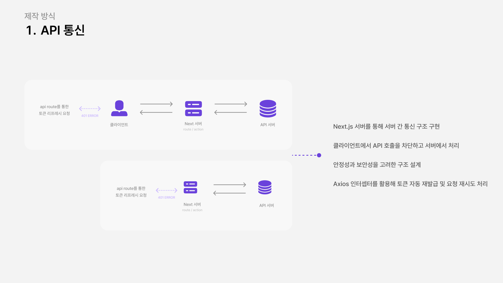
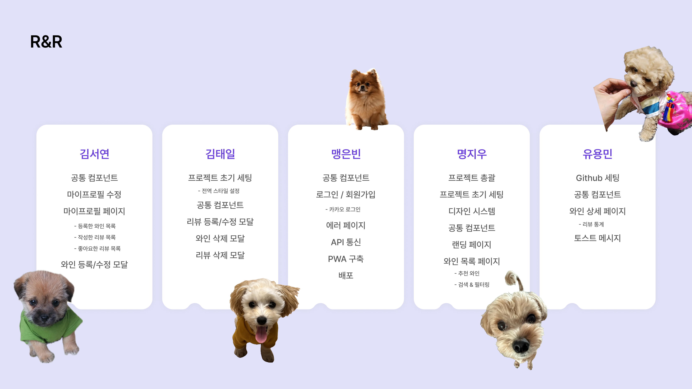

<<div style="text-align: center;"><h1> WINE PICK – 취향 기반 와인 셀렉션 🍇</h1></div>

<div style="text-align: center;">
  <br/>
  
  <br/><br/>
  <p>처음 마시는 와인, 어디서부터 시작해야 할지 막막하셨죠?</p>
<p>이곳에서는 수많은 와인 중 당신에게 맞는 한 잔을 쉽고 재미있게 찾을 수 있어요.</p>
<p>취향이 비슷한 사람들과 소통하고, 다양한 와인을 경험하며 나만의 취향을 만들어보세요.</p>
<p>오늘의 한 모금이 내일의 이야기가 됩니다. 지금, 와인의 세계로 한 걸음 들어오세요. 🍷</p>
</div>

## 🎈 프로젝트 소개

WINE은 와인을 탐색하고 와인을 사랑하는 사람들이 모여 소통할 수 있도록 만든 웹애플리케이션입니다.
다양한 와인을 쉽게 검색하고, 가격대나 종류별로 필터링하며, 원하는 와인을 빠르게 찾을 수 있어요.
나만의 와인 창고를 관리하며, 좋아하는 와인을 등록하고, 자유롭게 리뷰를 남길 수 있어요.

"이제 와인 고를 때 자신 있어요! 🍷"
"다른 사용자 리뷰를 보고 새로운 와인을 시도해 봤어요! 💬"
"내가 좋아하는 와인을 쉽게 기록하고 공유할 수 있어서 좋아요! 🙌🏻"

## 🚀 배포 서비스

[다양한 와인을 경험해보고, 당신의 취향을 공유해주세요! 🍷](https://wine-nu.vercel.app)

## 📄 페이지별 기능 정리

### 1️⃣ API 통신 구조

- 클라이언트 → Next.js 서버 → API 서버로 요청을 위임하는 구조
- 클라이언트에서 직접 API 요청을 차단하고 서버 측에서 처리함으로써 보안 강화
- Axios 인터셉터를 통해 401 응답 시 토큰 자동 재발급 및 재요청 처리

## 

### 2️⃣ 로그인 / 회원가입 페이지

#### ✅ 카카오

- OAuth 2.0 기반 소셜 로그인 구현 (카카오)
- Access/Refresh 토큰을 HTTP Only + Secure 쿠키에 저장하여 보안 강화
- Zustand의 `persist` 기능을 통해 새로고침 후에도 로그인 상태 유지


---

### 3️⃣ 와인 목록 페이지

#### ✅ 와인 검색

- 키워드 기반 검색 기능 구현
- 와인 삭제, 리뷰 등록/수정/삭제 시 캐싱 무효화
- 디바운싱 적용으로 API 요청 최소화

#### ✅ 필터링 기능

- 와인 종류, 가격대, 평점 등 다양한 조건으로 필터링 가능

#### ✅ SSR & CSR 전략 병행

- 추천 와인은 SSR 기반 렌더링으로 초기 로딩 속도 개선
- 검색 및 필터링은 CSR로 처리하여 사용자 경험 향상
- `revalidateTag`로 캐시된 데이터 자동 무효화 처리

## 

### 4️⃣ 와인 상세 페이지

#### ✅ 리뷰 작성 / 관리

- 별점, 향 선택(MultiSelect), 텍스트 입력 등 리뷰 작성 기능 제공
- 작성한 리뷰는 수정/삭제 가능하며, 등록 후 `invalidateQueries`로 즉시 반영
- 리뷰 수정 시 기존 데이터 prefill 처리로 UX 향상
- useInfiniteQuery 기반 무한 스크롤 리뷰 로딩
- 리뷰 통계 시각화 제공


---

### 5️⃣ 마이페이지

#### ✅ 반응형 디자인

- Tailwind CSS 기반 반응형 UI 구성
- grid/flex 기반 레이아웃으로 PC/태블릿/모바일 대응

### ✅ 페이지

- 초기 성능을 고려해 SSR 적용하여 인터렉션이 적은 페이지로 구성

#### ✅ 페이지 전환 UX

- Parallel Routes + Intercept Routing 적용으로 탭 간 자연스러운 전환 구현
- 중첩 라우트 및 공통 Layout을 활용해 마이페이지 영역 유지


---

### 6️⃣ 공통 모달 시스템

#### ✅ 모달 시스템 (와인/리뷰)

- Slot 패턴 기반의 재사용 가능한 컴포넌트 설계
- Tanstack Query 연동으로 모달 내 데이터 변경도 자동 반영
- 반응형 디자인 적용으로 모든 디바이스에서 최적화된 UX 제공


## ⚙️ 커밋 컨벤션

```bash
[#123] feat: 로그인 기능 구현함
[#456] fix(api): 응답 필드 누락 수정함
[#789] fix(api): 응답 필드 누락 수정함
```

## 📁 디렉토리 구조

```
WHYNE/
├── public/
└── src/
    ├── apis/                    # API 인스턴스 설정
    ├── app/
    │   ├── (non-header)/        # 헤더 없는 페이지
    │   │   ├── login/           # 로그인 페이지
    │   │   ├── signup/          # 회원가입 페이지
    │   │   └── design-system/   # UI 컴포넌트 시스템
    │   ├── (with-header)/       # 헤더 있는 페이지
    │   │   ├── myprofile/       # 마이페이지
    │   │   │   └── (tab)/       # 탭 기반 UI
    │   │   └── wines/           # 와인 관련 페이지
    │   │       └── [wineId]/    # 와인 상세 페이지
    │   └── api/                 # Next.js API 라우트
    │       ├── auth/            # 인증 API
    │       ├── images/          # 이미지 업로드
    │       └── wines/           # 와인 관련 API
    ├── components/              # 재사용 컴포넌트
    ├── stores/                  # 상태 관리 (Zustand)
    ├── libs/                    # 유틸리티 라이브러리
    └── types/                   # TypeScript 타입 정의
```

## 🛠 기술 스택

### 🖥️ 프론트엔드

<div className="flex flex-wrap items-center gap-2">
  
  
  
  
  
  
  
  
  
  
</div>

### 스타일링

<div>


</div>

### 🛠️ 개발 환경 및 도구

<div>


### 🚀배포

</div>

<div>

### 🔍 코드 품질 관리

<div>


</div>

### 📄 문서화 및 협업

<div>


</div>

## 👥 팀원 소개


